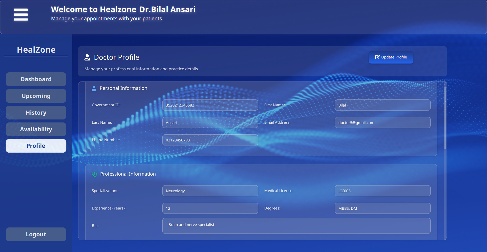
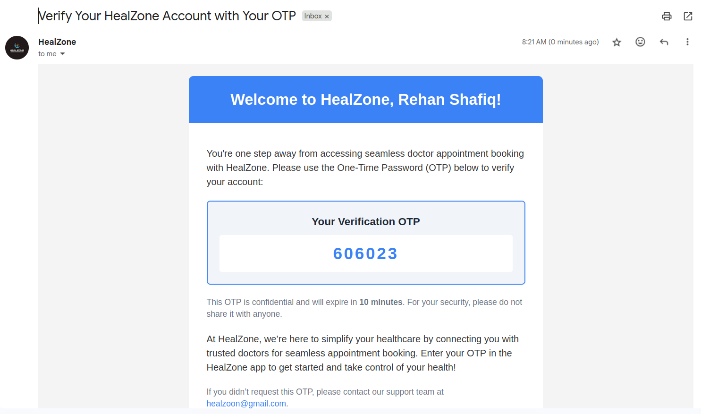

# 📘 HealZone-2.0 Documentation


Hi, everyone! 👋 I’m **Rehan Shafiq**, a Software Engineering student at **COMSATS University Islamabad, Sahiwal Campus**. Welcome to the complete documentation for **HealZone-2.0**, my project built as part of my coursework. HealZone is a desktop application that makes booking doctor appointments super easy, eliminating the hassle of waiting in long hospital lines. This document covers everything about the project — from what it does, how it’s built, to how you can set it up and use it. Let’s dive in! 🚀

> **Last Updated**: July 18, 2025  
> **Author**: Rehan Shafiq [](https://github.com/Rehancodecraft)  
> **Contact**: [rehan.codecraft@gmail.com](mailto:rehan.codecraft@gmail.com)

---

## Table of Contents

- [Introduction](#introduction)
- [Problem Statement](#problem-statement)
- [Objectives](#objectives)
- [Scope](#scope)
- [Software & Hardware Requirements](#software--hardware-requirements)
- [Functional Requirements](#functional-requirements)
- [Non-Functional Requirements](#non-functional-requirements)
- [System Design](#system-design)
- [Testing](#testing)
- [User Manual](#user-manual)
- [Deployment Steps](#deployment-steps)
- [Conclusion](#conclusion)
- [References](#references)
- [Acknowledgements](#acknowledgements)

---

## Introduction

**HealZone-2.0** is a user-friendly desktop application built to simplify the process of booking doctor appointments. No more standing in long lines or wondering if your doctor is available! With HealZone, patients can check doctor schedules, book appointments online, and arrive at the hospital at the right time — all from the comfort of their homes.

### Why HealZone?
Visiting a hospital to book an appointment is often frustrating. You wait in queues, check doctor availability, and sometimes leave without an appointment. HealZone solves this by bringing the entire process online, saving time and effort for both patients and doctors.

### Technologies Used
Here’s the tech stack I used to build HealZone:
- **Programming Language**: Java
- **UI Framework**: JavaFX
- **Styles**: CSS
- **Database**: PostgreSQL (with SQLite support)
- **Build Tool**: Maven
- **Libraries**: JavaFX, PostgreSQL JDBC, SQLite JDBC
- **IDE**: IntelliJ IDEA
- **Operating System**: Windows/Linux

### Who Is This For?
- **Patients**: Book appointments, view doctor schedules, and access prescriptions.
- **Doctors**: Manage availability, write prescriptions, and view appointment history.
- **Developers**: Understand the code and extend the system.

### Project Goals
HealZone aims to:
- Provide a fast and easy way to book doctor appointments online.
- Show real-time doctor availability to patients.
- Ensure a secure and user-friendly experience for everyone.

---

## Problem Statement

Booking a doctor’s appointment in person is a time-consuming and frustrating process. Patients often have to:
- Wait in long lines at the hospital.
- Check if their preferred doctor is available.
- Deal with scheduling conflicts or unavailability.

This manual process wastes time, causes frustration, and disrupts both patients’ and doctors’ schedules. **HealZone-2.0** solves this by providing an online platform where patients can book appointments in just a few clicks, check real-time doctor availability, and plan their visits without hassle.

---

## Objectives

The main objectives of HealZone are:
- To create a seamless online appointment booking system.
- To allow doctors to manage their schedules efficiently.
- To provide a secure login system with OTP verification.
- To enable patients to view and download prescriptions.
- To ensure the application is easy to use and responsive.

---

## Scope

### What HealZone Covers
- Patient registration and login with OTP verification.
- Doctor registration with detailed professional information.
- Appointment booking with real-time doctor availability.
- Prescription creation and viewing.
- Profile management for both patients and doctors.

### What HealZone Does Not Cover
- Online payment for appointments.
- Video consultation features.
- Cloud-based deployment (currently desktop-based).

---

## Software & Hardware Requirements

### Software Requirements
- **Operating System**: Windows 10/11 or Linux
- **Java**: JDK 11 or above
- **Maven**: For building the project
- **Database**: PostgreSQL (or SQLite)
- **IDE**: IntelliJ IDEA (recommended) or Eclipse
- **Libraries**: JavaFX, PostgreSQL JDBC, SQLite JDBC

### Hardware Requirements
- **RAM**: Minimum 4GB (8GB recommended)
- **Storage**: 500MB free space
- **Processor**: Any modern CPU (e.g., Intel i3 or equivalent)

---

## Functional Requirements

HealZone supports the following features:
- **User Authentication**: Email-based login with OTP for patients and doctors.
- **Appointment Booking**: Patients can view and book available doctor time slots.
- **Doctor Availability**: Doctors can set and update their schedules.
- **Prescription Management**: Doctors can write and save prescriptions; patients can view them.
- **Profile Management**: Both users can edit their profiles (some doctor fields are locked).
- **Appointment History**: View past and upcoming appointments for both roles.

---

## Non-Functional Requirements

- **Performance**: The app loads pages within 2 seconds.
- **Security**: Passwords are encrypted, and OTPs ensure secure access.
- **Usability**: The interface is intuitive with clear navigation.
- **Scalability**: Supports multiple users and appointments without performance issues.

---

## System Design

HealZone uses a modular architecture with separate components for patients and doctors. Below are the key diagrams (to be added):
- **ER Diagram**: Shows the database structure (e.g., tables for Patients, Doctors, Appointments).
- **Use Case Diagram**: Illustrates user interactions (e.g., booking, viewing schedules).
- **Architecture Diagram**: Depicts the flow between UI, backend, and database.

*Note*: I’ll embed the diagrams here once created using Draw.io. For now, here’s a placeholder for the ER Diagram:


---

## Testing

The application was tested with the following cases:
- **Login Test**: Valid/invalid credentials for patients and doctors.
- **Appointment Booking**: Booking with available/unavailable slots.
- **Prescription**: Creating and viewing prescriptions.
- **Performance**: Ensuring pages load quickly.

Detailed test cases will be added in this section with screenshots.

---

## User Manual

### For Patients
1. **Register/Login**: Sign up with email and verify using OTP.
2. **Book Appointment**: Select a doctor, view available slots, and confirm.
3. **View History**: Check past appointments and prescriptions.
4. **Update Profile**: Edit personal details.

### For Doctors
1. **Register/Login**: Sign up with professional details and verify via OTP.
2. **Set Availability**: Add available time slots.
3. **Manage Appointments**: View and mark appointments as attended.
4. **Write Prescriptions**: Create and save prescriptions for patients.

##  System Architecture
The architecture diagram below illustrates the major components and interactions within the HealZone-2.0 system.


---

##  Use Case Diagram
This use case diagram highlights the primary actors and their interactions with the system.


---

## 📸 Screenshots

---

### 🔐 Login & Registration

- 
- 
- 
- 

---

### Patient Dashboard

- 

---

### Book Appointment & View in Upcoming

- 
- 

---

### View History of Appointments with Prescriptions

- 

---

### Update Profile
- 

---

### Doctor Dashboard

- 

---

### 👨‍⚕️ Prescription Writing

- 
- 

---

###   Doctor Upcoming Appointments

- 
---
### Doctor History of Appointments
- 
---
### Update Availability
- 
---
### Update Profile
- 

---

### Forget Password


- 

---

### Email Verification & OTP

- 
- 

---


## Deployment Guide

This section outlines the complete steps required to set up, configure, and run the HealZone-2.0 application on a development machine.

---

### 1. System Requirements

#### Software Requirements
- **Java Development Kit (JDK)**: Version 17 or higher
- **Apache Maven**: Version 3.6+
- **IntelliJ IDEA**: Recommended IDE (with JavaFX plugin installed)
- **PostgreSQL**: Version 12 or higher
- **Scene Builder**: For GUI layout preview (optional but recommended)

#### Hardware Requirements
- **Processor**: Intel i3 or equivalent (minimum), i5 or higher recommended
- **RAM**: Minimum 4 GB (8 GB recommended)
- **Storage**: At least 500 MB free for project files and dependencies
- **Operating System**: Windows, macOS, or Linux (Ubuntu preferred for development)

---

### 2. Required Libraries & Tools

The following libraries and tools are utilized in this project:

- **JavaFX** – GUI framework
- **PostgreSQL JDBC Driver** – For database connectivity
- **Apache Maven** – Dependency and build management
- **JFoenix** (optional) – Enhanced UI components
- **ControlsFX** (optional) – Additional UI controls

> All dependencies are managed automatically via Maven and defined in the `pom.xml` file.

---

### 3. Clone the Repository

Use Git to clone the project:

```bash
git clone https://github.com/Rehancodecraft/HealZone-2.0.git
```
### 4. Database Setup

#### Step 1: Create the PostgreSQL Database
- Launch **pgAdmin** or your preferred PostgreSQL client.
- Create a new database named: HealZone
- Copy Script from **HealZone-2.0-Script-for-psql** and paste in **pgAdmin** to create database
#### Step 2: Update Database Configuration
- Navigate to the following file:
```swift
src/main/java/com/example/healzone/config/DatabaseConfig.java
```
- Update the PostgreSQL credentials to match your local configuration:
```bash
private static final String URL = "jdbc:postgresql://localhost:5432/HealZone";
private static final String USER = "your_username";
private static final String PASSWORD = "your_password";
```
### 5. Build the Project

- Open your terminal inside the project root directory and run the following command:
```bash
mvn clean install
```

This command will compile the project and download all required dependencies defined in pom.xml.
### 3. Run the Application

To launch the JavaFX desktop application, execute the following command:
```bash
mvn javafx:run
```
Alternatively, you can run the application from within IntelliJ IDEA by executing the Main class using the built-in run configuration.
### 7. Troubleshooting Tips

   - Ensure the JavaFX SDK is properly configured in your IDE settings.

   - Make sure the PostgreSQL service is running and accessible.

   - Verify the JDBC URL, username, and password inside DatabaseConfig.java.

   - If the Maven build fails:
```bash
   mvn clean install -U
   ```

   This forces Maven to update dependencies and rebuild the project.

   Delete the target/ directory manually if stale build artifacts cause unexpected errors.

### 8. Customization Notes

You can customize or extend the functionality of HealZone-2.0 by modifying the following components:
- FXML Layouts

  Located in:
```swift
src/main/resources/com/example/healzone/Fxml/
```

- Business Logic
Java classes can be updated or extended in:
```swift
src/main/java/com/example/healzone/
```
- Database Configuration
To connect with a different database, update the JDBC URL, username, and password in:
```swift
    src/main/java/com/example/healzone/config/DatabaseConfig.java
```
 >   ⚠️ Always use proper version control and maintain backups before making any structural or functional changes.

